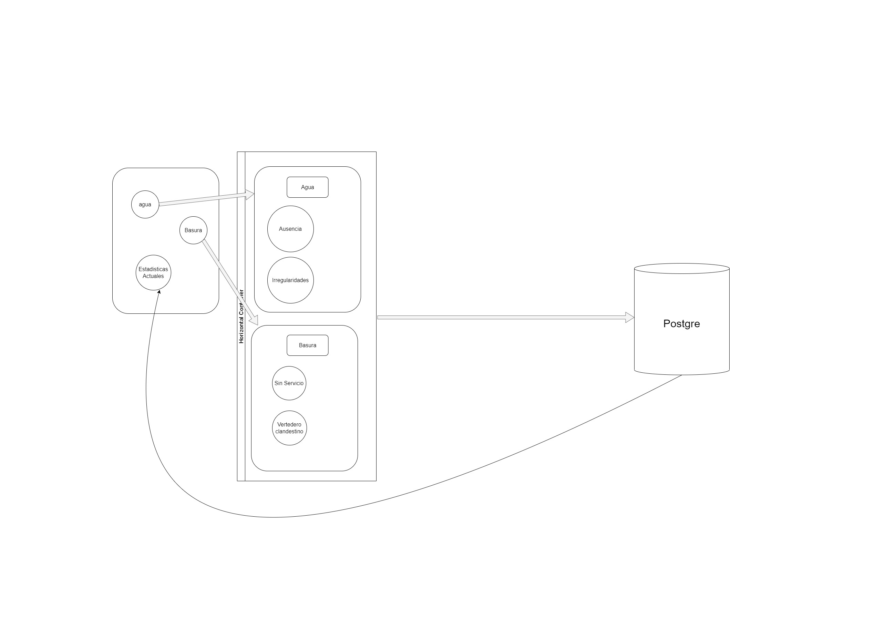

MIZUGOMI

App Description:

Reporting web app service that enables users to create/update complain reports about their basic services accesability and/or availability.
Intended to gather data about critical areas in third-world countries where inhabitants have limited access to these basic services.

Basic app flow 

App developed by
BigBang™
